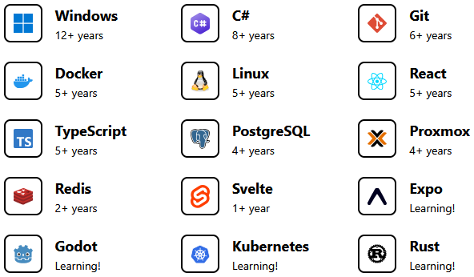

Active and new projects will be available on https://git.codeguilds.org/Mitchell. This account will only be used for mirroring purposes.

# Hi, I'm Mitchell!

I am a self-taught developer and privacy advocate living in Australia. I am currently studying a **Bachelor of Information Technology** in **Cyber Security** and Application Development.

---

### Experience

I have a lot of experience in various different areas, such as:

*Note: This list only includes tools that I actively still use.*

---

### Current Projects

- **[Aurora](https://git.codeguilds.org/Nexirift/aurora)**: A self-hostable Nexirift social media server, built from the ground up.
- **[Dawn](https://git.codeguilds.org/Nexirift/dawn)**: The web and mobile app used for the Nexirift social media platform.
- **Keystone**: Flexible software activation, built for both small teams and enterprises.

*Note: Some of the projects listed here may not be available yet or are private.*

### Let's Discuss

- **Social Media**: Ideas, decentralisation, positives and negatives.
- **Infrastructure**: Virtual machines, containers, OCI (Docker).
- **Game Development**: Game design, game engines (Godot).

### Contact Me

- **Email**: [gh@creaous.net](mailto:gh@creaous.net) - I typically respond in a few hours.

### Support My Work

I have a few platforms that you can support me on!

- **GitHub**: [@Creaous](https://github.com/sponsors/Creaous) - My (current) primary platform.
<!-- - **Nexirift**: [@Mitchell](https://nexirift.com/@Mitchell/sponsor) - My preferred platform. -->
